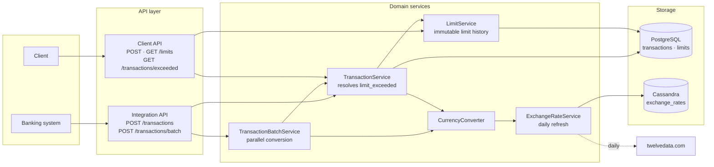
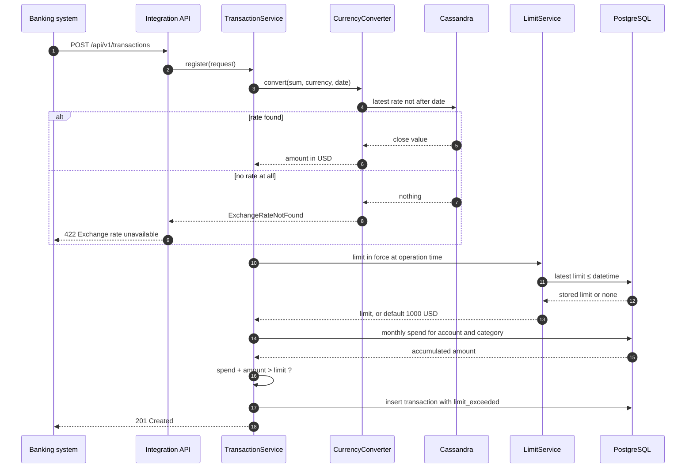
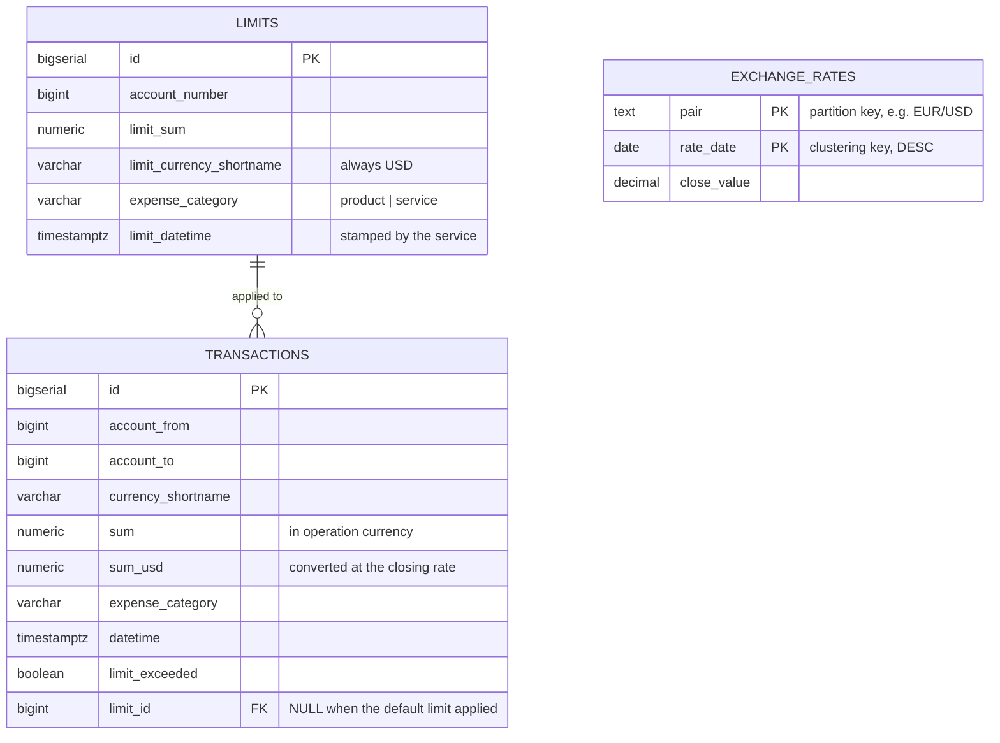
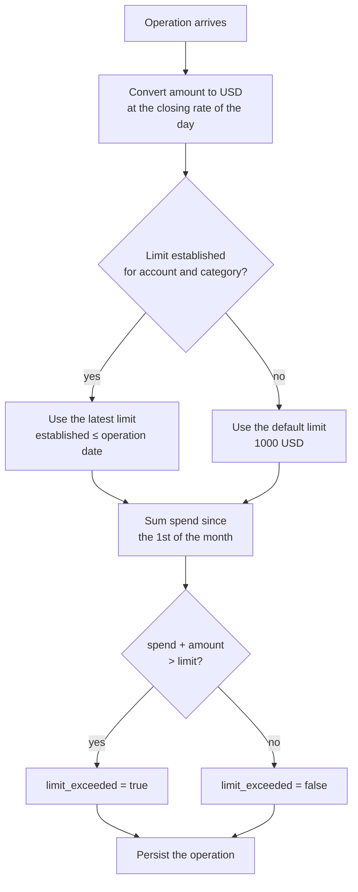

# Transactions Service

A microservice that enforces monthly spending limits for bank clients.

It ingests spending operations in arbitrary currencies, converts them to USD at the exchange
rate of the spending day, compares the accumulated monthly spend against the limit for that
expense category, and marks every operation that goes past the limit with a `limit_exceeded`
flag.

---

## Contents

- [Features](#features)
- [Tech stack](#tech-stack)
- [Architecture](#architecture)
- [Data model](#data-model)
- [Limit logic](#limit-logic)
- [Exchange rates](#exchange-rates)
- [Running the service](#running-the-service)
- [Configuration](#configuration)
- [API](#api)
- [Usage examples](#usage-examples)
- [Tests](#tests)
- [Design notes and limitations](#design-notes-and-limitations)

---

## Features

- ingestion of spending operations in EUR, USD and any other configured currency, one by one
  or as a batch;
- monthly limits kept separately per expense category, `product` and `service`;
- a default limit of 1000 USD for clients who never set one;
- a daily exchange rate feed based on closing prices, falling back to the previous close on
  weekends and holidays;
- automatic marking of operations that breach the monthly limit;
- establishing a new limit with a server-assigned date; established limits are never modified;
- a list of operations that breached their limit, enriched with the parameters of that limit;
- API documentation served as Swagger UI.

## Tech stack

| Component        | Choice                                   |
|------------------|------------------------------------------|
| Language, runtime| Java 17, Spring Boot 3.2                 |
| API              | REST, springdoc-openapi (Swagger UI)     |
| Operation store  | PostgreSQL 16 with Spring Data JPA       |
| Rate store       | Apache Cassandra 4.1                     |
| Migrations       | Flyway, schema first                     |
| Testing          | JUnit 5, Mockito, AssertJ, H2, JaCoCo    |
| Build and run    | Maven Wrapper, Docker, Docker Compose    |
| CI               | GitHub Actions                           |

## Architecture

Two API surfaces sit on the same domain core. The integration surface receives operations from
the banking system; the client surface manages limits and reports breaches.



Key classes:

| Class                     | Responsibility                                                          |
|---------------------------|-------------------------------------------------------------------------|
| `LimitEvaluator`          | pure limit rules: the breach predicate, the remainder, month boundaries  |
| `TransactionService`      | ingestion, monthly spend aggregation, resolving `limit_exceeded`         |
| `TransactionBatchService` | batch ingestion with parallel currency conversion                        |
| `LimitService`            | establishing limits with a server date, resolving the limit in force     |
| `CurrencyConverter`       | converting an operation amount into USD                                  |
| `ExchangeRateService`     | fetching and serving rates, previous-close fallback                      |

### Ingestion flow

Every operation goes through the same path, and the flag is decided before the row is written.



## Data model

The schema is owned by Flyway ([`V1__init_schema.sql`](src/main/resources/db/migration/V1__init_schema.sql));
Hibernate only validates it (`ddl-auto: validate`), and that agreement is itself covered by a test.



`limits` rows are immutable: establishing a new limit appends a row, so the full history stays
queryable and past decisions remain reproducible.

`sum_usd` is stored alongside the operation on purpose. The conversion depends on the rate of one
specific day, and without the persisted value the flag decision could not be reconstructed later.

`exchange_rates` lives in Cassandra ([`schema.cql`](src/main/resources/db/cassandra/schema.cql)),
partitioned by pair and clustered by date descending, so "the latest rate not after date X" is a
single-row read from the head of the partition.

## Limit logic

1. The limit in force is the most recent one established for a given account and category no
   later than the operation date. If none exists, a default limit of 1000 USD applies.
2. The accumulated spend covers all operations of that account and category **from the start of
   the calendar month of the operation**. Establishing a new limit mid-month does not reset it.
3. An operation is flagged when the accumulated spend **including it** goes past the limit.
   A limit that is exactly used up does not count as exceeded.
4. The flag is decided at ingestion time and never recomputed retroactively: changing a limit
   only affects subsequent operations.



A worked example — a limit of 1000 USD, raised to 2000 USD on January 10th:

| Date       | Spend, USD | Accumulated | Limit | Remainder | `limit_exceeded` |
|------------|------------|-------------|-------|-----------|------------------|
| Jan 2      | 500        | 500         | 1000  | 500       | false            |
| Jan 3      | 600        | 1100        | 1000  | −100      | **true**         |
| Jan 10     | —          | 1100        | 2000  | 900       | limit raised     |
| Jan 11     | 100        | 1200        | 2000  | 800       | false            |
| Jan 12     | 700        | 1900        | 2000  | 100       | false            |
| Jan 13     | 100        | 2000        | 2000  | 0         | false            |
| Jan 13     | 100        | 2100        | 2000  | −100      | **true**         |

This scenario, and the mirror case where a limit is lowered below the amount already spent, are
covered by [`LimitEvaluatorTest`](src/test/java/ru/yaroslav_pavlenko/TransactionsRestApi/services/LimitEvaluatorTest.java)
at the rule level and by [`LimitScenarioIntegrationTest`](src/test/java/ru/yaroslav_pavlenko/TransactionsRestApi/services/LimitScenarioIntegrationTest.java)
end to end against a database.

## Exchange rates

- The source is [twelvedata.com](https://twelvedata.com), daily interval `1day`, `close` value.
- The scheduler refreshes rates every day at midnight (`app.exchange.cron`).
- If the provider does not quote `EUR/USD`, the reverse `USD/EUR` is requested and inverted.
- If today's close has not been published yet, the previous one is taken.
- A rate lookup always returns the last close not after the requested date, so weekends and
  public holidays are handled without special cases.
- If no rate exists at all, the operation is **rejected** with `422` rather than converted at
  some made-up value.

So the service can be started and exercised without a provider key, demo rates are written at
startup into pairs that hold no data yet (`app.exchange.seed-rates`). They never overwrite real
data. **Clear this block and set `TWELVEDATA_API_KEY` for production use.**

## Running the service

### Docker Compose (recommended)

Requires Docker with Compose V2.

```bash
docker compose up --build
```

This starts PostgreSQL, Cassandra and the service itself; the application boots once both
databases pass their health checks. The first Cassandra startup takes about a minute.

With a rate provider key:

```bash
TWELVEDATA_API_KEY=your_key docker compose up --build
```

Readiness check:

```bash
curl http://localhost:8080/actuator/health
```

Tear down including data:

```bash
docker compose down -v
```

### Local run

Requires JDK 17+, a PostgreSQL instance with a `transactions` database, and Cassandra.

```bash
docker compose up -d postgres cassandra
./mvnw spring-boot:run
```

On Windows use `mvnw.cmd`.

### Building a jar

```bash
./mvnw clean package
java -jar target/TransactionsRestApi-1.0.0.jar
```

## Configuration

Everything is driven by environment variables; the defaults target a local run.

| Variable                   | Default                                          | Purpose                     |
|----------------------------|--------------------------------------------------|-----------------------------|
| `POSTGRES_URL`             | `jdbc:postgresql://localhost:5432/transactions`   | PostgreSQL JDBC URL         |
| `POSTGRES_USER`            | `postgres`                                        | PostgreSQL user             |
| `POSTGRES_PASSWORD`        | `postgres`                                        | PostgreSQL password         |
| `CASSANDRA_CONTACT_POINTS` | `127.0.0.1`                                       | Cassandra contact points    |
| `CASSANDRA_PORT`           | `9042`                                            | Cassandra port              |
| `CASSANDRA_KEYSPACE`       | `transactions`                                    | keyspace holding the rates  |
| `CASSANDRA_DATACENTER`     | `datacenter1`                                     | driver local datacenter     |
| `TWELVEDATA_API_KEY`       | empty                                             | rate provider key           |
| `EXCHANGE_FETCH_ENABLED`   | `true`                                            | enables the rate refresh    |
| `SEED_RATE_EUR_USD`        | `1.0850`                                          | demo EUR/USD rate           |

Everything else lives in [`application.yml`](src/main/resources/application.yml).

## API

Once the service is running:

- Swagger UI — <http://localhost:8080/swagger-ui.html>
- OpenAPI JSON — <http://localhost:8080/v3/api-docs>

### Integration API — transaction ingestion

| Method | Path                          | Description                              |
|--------|-------------------------------|------------------------------------------|
| `POST` | `/api/v1/transactions`        | accept a spending operation              |
| `POST` | `/api/v1/transactions/batch`  | accept a batch of up to 1000 operations  |

### Client API — client requests

| Method | Path                                               | Description                       |
|--------|----------------------------------------------------|-----------------------------------|
| `POST` | `/api/v1/limits`                                   | establish a new limit             |
| `GET`  | `/api/v1/limits?accountNumber=123`                 | all limits of a client            |
| `GET`  | `/api/v1/transactions/exceeded?accountNumber=123`  | operations that breached a limit  |
| `GET`  | `/api/v1/transactions?accountNumber=123`           | all operations of a client        |

Both listings accept an optional `expenseCategory=product|service` filter.

### Response codes

| Code  | When                                                          |
|-------|---------------------------------------------------------------|
| `201` | operation accepted, limit established                         |
| `200` | successful read                                               |
| `400` | request body or parameters failed validation                  |
| `422` | exchange rate unavailable, the amount cannot be converted     |
| `500` | unexpected error                                              |

## Usage examples

Establish a limit of 1000 USD on goods:

```bash
curl -X POST http://localhost:8080/api/v1/limits \
  -H 'Content-Type: application/json' \
  -d '{"account_number": 123, "limit_sum": 1000.00, "expense_category": "product"}'
```

```json
{
  "id": 1,
  "account_number": 123,
  "limit_sum": 1000.00,
  "limit_currency_shortname": "USD",
  "expense_category": "product",
  "limit_datetime": "2022-01-10T00:00:00+06:00"
}
```

Submit a spending operation:

```bash
curl -X POST http://localhost:8080/api/v1/transactions \
  -H 'Content-Type: application/json' \
  -d '{
        "account_from": 123,
        "account_to": 9999999999,
        "currency_shortname": "EUR",
        "sum": 100.00,
        "expense_category": "product",
        "datetime": "2022-01-30T00:00:00+06:00"
      }'
```

```json
{
  "id": 1,
  "account_from": 123,
  "account_to": 9999999999,
  "currency_shortname": "EUR",
  "sum": 100.00,
  "sum_usd": 108.50,
  "expense_category": "product",
  "datetime": "2022-01-30T00:00:00+06:00",
  "limit_exceeded": false
}
```

List the operations that breached a limit:

```bash
curl 'http://localhost:8080/api/v1/transactions/exceeded?accountNumber=123'
```

```json
[
  {
    "id": 2,
    "account_from": 123,
    "account_to": 9999999999,
    "currency_shortname": "EUR",
    "sum": 1000.00,
    "sum_usd": 1085.00,
    "expense_category": "product",
    "datetime": "2022-01-30T00:00:00+06:00",
    "limit_sum": 1000.00,
    "limit_datetime": "2022-01-10T00:00:00+06:00",
    "limit_currency_shortname": "USD"
  }
]
```

## Tests

```bash
./mvnw test
```

The JaCoCo coverage report lands in `target/site/jacoco/index.html`.

Tests need neither Docker nor any external service: Spring slices run on an embedded H2, and both
the rate provider and the rate store are stubbed.

| Suite                            | What it covers                                                              |
|----------------------------------|------------------------------------------------------------------------------|
| `LimitEvaluatorTest`             | the `limit_exceeded` rules, multi-step spending scenarios, month boundaries   |
| `LimitScenarioIntegrationTest`   | the same scenarios end to end through a database, month rollover, categories  |
| `TransactionServiceTest`         | ingestion, the spend window, limit linking, the exceedance list               |
| `LimitServiceTest`               | server-assigned date, USD currency, immutability, the default limit           |
| `CurrencyConverterTest`          | conversion at the daily rate, rounding, behaviour when a rate is missing      |
| `ExchangeRateServiceTest`        | previous close, reverse pair inversion, running without a key, demo seeding   |
| `TransactionBatchServiceTest`    | parallel conversion and chronological ordering of writes                      |
| `TransactionRepositoryTest`      | the SQL behind monthly spend, exceedance selection and limit lookup           |
| `FlywayMigrationTest`            | the migrated schema matches the entity mappings under Hibernate validation    |
| `TransactionIngestControllerTest`, `ClientControllerTest` | the API contract, snake_case payloads, error codes |

## Design notes and limitations

Deliberate trade-offs worth knowing before extending the service:

- **No access control.** The API is open; authentication and authorisation are out of scope.
- **Flags are not recomputed retroactively.** Changing a limit affects only later operations;
  recomputing history would need a separate, explicit operation.
- **Operation ordering.** The flag is decided at ingestion, so operations arriving out of
  chronological order only see the spend already recorded.
- **Concurrency.** The calculation and the write share one database transaction, but heavy
  parallel load on a single account would need an account-level lock or serialisable isolation
  for strict correctness.
- **Demo rates are enabled by default** to keep the first run reproducible; disable them in
  production.
- **The scheduler assumes a single instance.** Scaling horizontally means moving the rate refresh
  into a dedicated process or a distributed scheduler.
